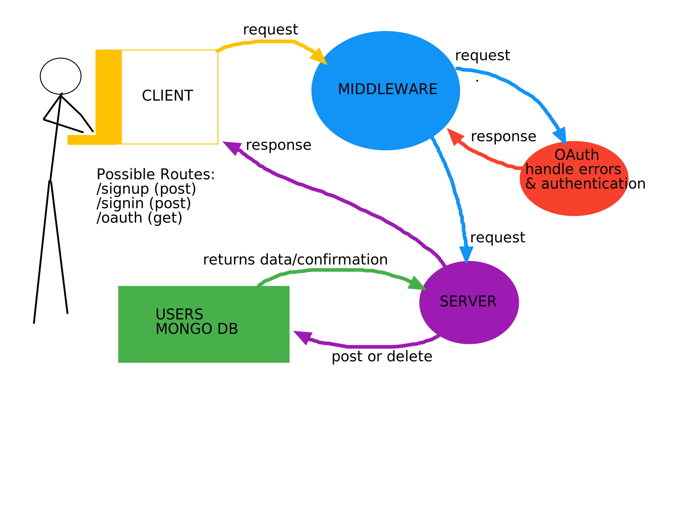

# auth-server
A 401 Project centered around experimenting with Basic Authorization and Authentication techniques.

### Author: David Palagashvili
- [Submission PR]()
- [Testing Report]()
- [Swagger Hub]()
- [Heroku deployment]()

### Setup:

#### Environement Requirements:

PORT=<port> If you don't specify, this should default to port 3000.

MONGODB_ATLAS_URI="mongodb+srv://davidoffili:<password>@cluster0-zslz6.mongodb.net/<dbname>?retryWrites=true&w=majority"

SECRET= it remains a secret for a reason!

#### Dependencies

- "base-64": "^0.1.0",
- "bcrypt": "^5.0.0",
- "cors": "^2.8.5",
- "dotenv": "^8.2.0",
- "express": "^4.17.1",
- "jsonwebtoken": "^8.5.1",
- "mongoose": "^5.9.20"

#### Testing Process

Tools used:
- jest
- cf-supergoose

#### Test Ran

To be continued...

#### Running our App

node index.js
nodemon index.js

#### UML

